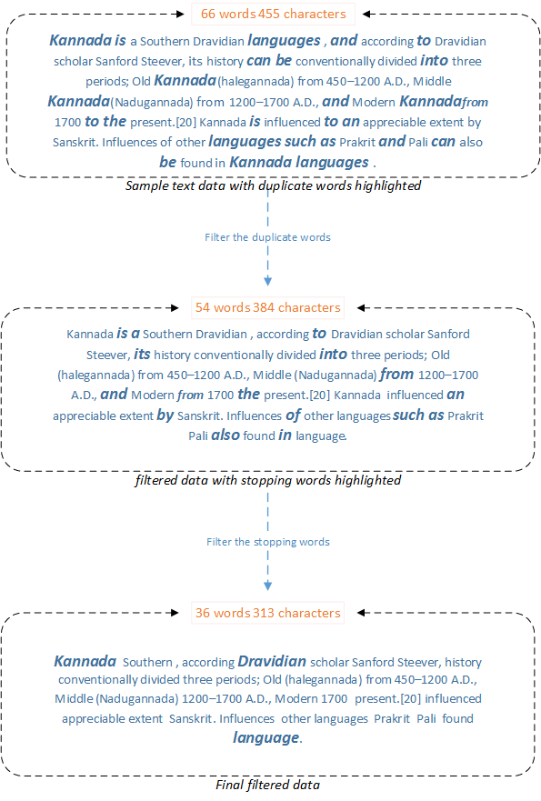

#  Exude API

!!! Version ""
    The latest version is: 1.0.0

    Open Source The Apache License.

Exude API is an Open Source project, It is used for the primary ways for filtering the stopping, stemming words from the text data. This API is in a very basic level of development need to work on for later changes.


## Features

* Filter stopping words from given text/file/link.
* Filter stemming words from given text/file/link.
* Get swear words from given text/file/link

## Stopping and Porter stemming algorithm

Stop words are words that are filtered out before or after processing of natural language data, Though "stop words" usually refers to the most common words in a language i.e this, that, what, where...etc 

The Porter stemming algorithm (or 'Porter stemmer') is a process for removing the commoner morphological and inflexional endings from words in English. 
Its main use is as part of a term normalization process that is usually done when setting up Information Retrieval systems.

Terms with a common stem will usually have similar meanings, for example:

```
REPORT
REPROTING
REPORTS
REPORTED

....
CONNECT
CONNECTION
CONNECTED
CONNECTING
CONNECTIONs

```

By removing the various suffixs -ED,-ING,-ION,IONS to leave the single word.


## How Exude API library works

1. Filter the duplicate words from the input data/file.
2. Filter the stopping words from step1 filtered data.
3. Filter the stemmer/swear words from step2 filtered data using the Porter algorithm which is used for suffix stripping.

exude process sequence flow:


## Demo
Please checkout the demo portal to test Exude API.

<a href="https://exude.herokuapp.com/" target="_blank">Exude API Demo!</a>
